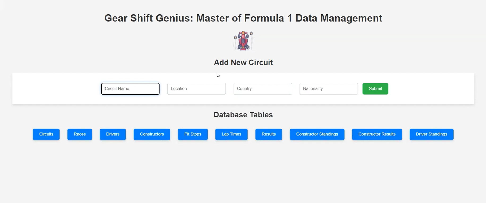

# GearShift-DB

# Database Management and Query Language

Gear Shift Genius: Master of Formula 1 Data Management

## Team Members

-   **Charvi Kusuma** [GitHub](https://github.com/kcharvi)
-   **Tarun Reddi** [GitHub](https://github.com/REDDITARUN)

## Problem Statement

How can the implementation of a comprehensive database system tailored specifically for Formula 1 data management enhance efficiency, collaboration, and decision-making across teams and stakeholders within the sport?

In Formula 1 racing, managing extensive data is crucial for effective strategies, performance enhancement, and trend identification. Current methods involve manual processes and slow tools like Excel, leading to inefficiencies and limited insights. To overcome these challenges, we’re developing a tailored database solution for Formula 1. It consolidates data into a single platform, streamlining processing and enabling seamless collaboration among teams, while they draw up interesting insights through visualizations. This system employs advanced techniques and user-friendly interfaces to empower teams with informative decisions and competitive edge.

## Background

Formula 1 racing demands perfection in every aspect, from car design to race strategy. Data analysis is crucial for gaining a competitive edge, be it optimizing performance or evaluating drivers. Yet, current data management methods, relying on Excel or fragmented databases, fall short.

Developing a tailored database solution for Formula 1 stems from several factors. Firstly, the sport thrives on technological advancement and data-driven decision-making. Secondly, existing methods are outdated, hindering performance. Lastly, a well-designed database can streamline workflows, enhance collaboration, and unlock insights, driving the sport forward.

## Objectives

-   Develop a centralized database system that integrates various datasets related to Formula 1, including race results, driver standings, lap times, and more.
-   Design an intuitive user interface that allows easy data entry, retrieval, and analysis for team personnel, analysts, and stakeholders.
-   Implement robust data validation and integrity checks to ensure the accuracy and reliability of the stored information.
-   Enable advanced analytics and reporting features to uncover insights, trends, and correlations within the data.
-   Facilitate collaboration and knowledge sharing among team members by providing secure access to the database from multiple locations.

## Significance of the Problem

Efficient data management is crucial for Formula 1 teams to remain competitive. Transitioning from Excel to a dedicated database streamlines workflows, reduces errors, and maximizes data potential. This project offers a scalable, user-friendly platform empowering teams to make data-driven decisions and achieve success on the track.

## Potential Contribution

The proposed database solution aims to revolutionize Formula 1 data management by offering a unified platform for storing, analyzing, and accessing critical information. By centralizing data and providing powerful analytics tools, teams can gain deeper insights into performance, identify areas for improvement, and innovate strategies to outperform rivals. Additionally, the database’s accessibility and ease of use can democratize data access within teams, enabling cross-functional collaboration and fostering a culture of continuous improvement. Overall, this project has the potential to elevate Formula 1 data management, driving innovation, competitiveness, and success in the sport.

## Target User

The Formula 1 database caters to teams’ needs, including engineers, strategists, data analysts, and managers, who rely on accurate data for race strategies, car development, and driver performance analysis. Stakeholders like sponsors, broadcasters, and regulatory bodies may also access the database for insights into Formula 1 racing.

1. Formula 1 Teams:

-   Engineers will analyze car performance data to improve vehicle design and setup.
-   Strategists will develop race strategies based on historical data and real-time insights.
-   Data Analysts will extract trends and patterns to optimize team performance.
-   Team Managers will monitor overall team operations and make strategic decisions.

2. Stakeholders:

-   Sponsors will evaluate team performance and exposure for sponsorship decisions.
-   Broadcasters will use race data for commentary and analysis during broadcasts.
-   Regulatory Bodies will monitor compliance with racing regulations and ensure fair competition.

3. Database Administration: The Formula 1 database would be managed by a team of database admin- istrators (DBAs) or IT personnel within each team. These administrators ensure data security, integrity, and performance, while also providing technical support to users. Larger teams may have specialized roles like data analysts or scientists to extract insights from the data. The F´ed´eration Internationale de l’Automobile (FIA) may also have administrators managing a central database for regulatory purposes and data dissem- ination.

## ER Diagram

> Relationships between different tables

The below cardinalities describe the relationships between the tables based on the primary and foreign keys defined in each table’s schema. They help understand how data is organized and connected within the database.

A weak entity is an entity that cannot be uniquely identified by its own attributes and relies on the existence of another entity, called the owner entity, for its identity. The below represents other relationships apart from cardinality:

> Total Participation:

-   Circuits table participates totally in the Races table through the foreign key CircuitID.
-   Races table participates totally in the Results, ConstructorsStandings, ConstructorsResults, Driver- Standings, PitStop, and LapTimes tables through the foreign key RaceID.
-   Driver table participates totally in the Results, DriverStandings, PitStop, and LapTimes tables through the foreign key DriverID.
-   Constructors table participates totally in the Results, ConstructorsStandings, and Construc- torsResults tables through the foreign key ConstructorsID.

> Partial Participation:

-   There are no partial participations observed in this schema. Each entity participates fully in the relationships defined by the foreign keys.

> Weak Entity:

-   PitStop table can be considered a weak entity as its primary key consists of foreign keys (RaceID and DriverID), and its existence depends on the combination of these foreign keys, which are also primary keys in their respective tables (Races and Driver).

> Other Information:

-   The LapTimes table’s primary key consists of foreign keys RaceID, DriverID, and Lap, along with other attributes like LapTime.
-   While it’s true that LapTimes also depends on the race and the driver for its existence, the Lap attribute adds another level of specificity. The Lap attribute represents the lap number within a race. Therefore, given a specific race, driver, and lap number, we can uniquely identify a lap time record.
-   Unlike PitStop, LapTimes does not rely solely on the existence of other entities for its identity. It has its own unique identifier (RaceID, DriverID, Lap), making it a strong entity.

### Diagrams


Figure 1: ER Diagram from PGAdmin


Figure 2: Created ER Diagram

## Tasks

The Formula 1 database serves as a central repository of data that supports various queries and updates essential for Formula 1 teams, analysts, stakeholders, and regulatory bodies. We can use the data for various purposes such as:

> Race Strategy Optimization:

-   Query: Analyze lap times and pit stop frequencies to determine optimal pit stop strategies. Identify races with high variability in lap times or frequent pit stops to adjust race strategy accordingly. Identify the circuits with the highest number of overtakes. Analyze average lap times for each circuit to identify trends and performance variations. Determine the correlation between grid position and final race position and many more other race optimization results.
-   Update: Record real-time race data during the event, including lap times, pit stops, and other conditions, to adjust race strategies accordingly.

> Performance Analysis:

-   Query: Analyze driver and constructor standings over multiple seasons to identify trends, strengths, and weaknesses. Analyze the correlation between constructor nationality and performance. Analyze lap time improvements over consecutive seasons. Identify the constructors with the most wins in a given season ets.
-   Update: Update driver and constructor standings after each race with the latest points, positions, and wins.

> Car Development:

-   Query: Analyze the average lap time of each constructor over multiple races. Identify races with the fastest average lap times to evaluate car performance. Determine the average number of pit stops made by drivers for each constructor. Analyze lap time improvements for specific car configurations or updates etc.
-   Update: Record telemetry data from car testing sessions to track performance improvements and validate design changes in next race.

> Driver Evaluation:

-   Query: Compare race performances of different drivers to assess their skill levels and potential. Analyze the number of overtakes made by each driver in a race. Evaluate driver consistency by analyzing their position changes during a race etc.
-   Update: Record driver performance data, including fastest lap times, overtakes, and race incidents, to evaluate driver performance.

> Database Creation:

For each of relations in the ER diagram, we have created the tables in database and inserted the values. The head of each table is displayed below:

```
-- Create Circuits table
CREATE TABLE Circuits (
CircuitID SERIAL PRIMARY KEY,
CircuitName VARCHAR(100),
CircuitLocation VARCHAR(100),
CircuitCountry VARCHAR(100),
CircuitNationality VARCHAR(100) );
```


Figure 3: Circuits Relation

```
-- Create Races table
CREATE TABLE Races (
RaceID SERIAL PRIMARY KEY,
RaceYear INTEGER,
RaceRounds INTEGER,
CircuitID INTEGER REFERENCES Circuits(CircuitID));
```


Figure 4: Races Relation

```
-- Create Driver table
CREATE TABLE Driver (
DriverID SERIAL PRIMARY KEY, DriverCode VARCHAR(10), DriverFirstName VARCHAR(50), DriverLastName VARCHAR(50), DriverDOB DATE, DriverNationality VARCHAR(100), DriverHome VARCHAR(100)
);
```


Figure 5: Drivers Relation

```
-- Create Constructors table
CREATE TABLE Constructors (
ConstructorsID SERIAL PRIMARY KEY, ConstructorsName VARCHAR(100), ConstructorsNationality VARCHAR(100), ConstructorsHome VARCHAR(100)
);
```


Figure 6: Constructors Relation

```
-- Create Results table
CREATE TABLE Results (
ResultID SERIAL PRIMARY KEY,
GridPosition INTEGER,
GridRacePosition INTEGER,
RacePoints FLOAT,
RaceLaps INTEGER,
FastestLap INTEGER,
FastestLapRank INTEGER,
FastestLapTime INTERVAL,
FastestLapSpeed FLOAT,
RaceID INTEGER REFERENCES Races(RaceID),
DriverID INTEGER REFERENCES Driver(DriverID),
ConstructorsID INTEGER REFERENCES Constructors(ConstructorsID) );
```


Figure 7: Results Relation

```
-- Create ConstructorsResults table
CREATE TABLE ConstructorsResults (
ConstructorsResultsID SERIAL PRIMARY KEY, ConstructorsPointsPerRace FLOAT,
RaceID INTEGER REFERENCES Races(RaceID),
ConstructorsID INTEGER REFERENCES Constructors(ConstructorsID) );
```


Figure 8: Constructor Results Relation

```
-- Create DriverStandings table
CREATE TABLE DriverStandings (
DriverStandingsID SERIAL PRIMARY KEY, DriverPointsPerRace FLOAT,
DriverOverallPosition INTEGER,
DriverTotalWins INTEGER,
RaceID INTEGER REFERENCES Races(RaceID),
DriverID INTEGER REFERENCES Driver(DriverID) );
```


Figure 9: Driver Standings Relation

```
-- Create ConstructorsStandings table
CREATE TABLE ConstructorsStandings (
ConstructorsStandingsID SERIAL PRIMARY KEY, ConstructorsPointsOverall FLOAT,
ConstructorsPosition INTEGER,
ConstructorsTotalWins INTEGER,
RaceID INTEGER REFERENCES Races(RaceID),
ConstructorsID INTEGER REFERENCES Constructors(ConstructorsID) );
```


Figure 10: Constructor Standings Relation

```
-- Create PitStop table
CREATE TABLE PitStop (
RaceID INTEGER REFERENCES Races(RaceID), DriverID INTEGER REFERENCES Driver(DriverID), Stop INTEGER,
PitStopLap INTEGER,
Milliseconds INTEGER,
PRIMARY KEY (RaceID, DriverID, Stop)
);
```


Figure 11: Pit Stops Relation

```
-- Create LapTimes table
CREATE TABLE LapTimes (
RaceID INTEGER REFERENCES Races(RaceID), DriverID INTEGER REFERENCES Driver(DriverID), Lap INTEGER,
DriverPositionPerLap INTEGER,
LapTime INTERVAL,
PRIMARY KEY (RaceID, DriverID, Lap)
);
```


Figure 12: Lap Time Relation

> Advanced Queries Validation

For each of the below use cases we have defined previousy, we are validating the created database design to extract useful insights. Some example queries and their outputs are given below.

-   Race Strategy Optimization Use Case: Analyze the average number of pit stops per race:

```
SELECT RaceID, AVG(Stop) AS AvgPitStops
FROM PitStop
GROUP BY RaceID;
```


Figure 13: Avg Pit Stops per Race

-   Performance Analysis: Analyze lap time improvements over consecutive seasons

```
SELECT RaceYear, AVG(LapTime) AS AverageLapTime
FROM Races
INNER JOIN LapTimes ON Races.RaceID = LapTimes.RaceID GROUP BY RaceYear
ORDER BY RaceYear;
```


Figure 14: Lap Time Improvements per Season

-   Car Development: Analyze average lap time of each constructor over multiple races

```
SELECT ConstructorsID, AVG(LapTime) AS AverageLapTime
FROM LapTimes
INNER JOIN Results ON LapTimes.RaceID = Results.RaceID AND LapTimes.DriverID = Results.DriverID
GROUP BY ConstructorsID
ORDER BY AverageLapTime;
```


Figure 15: Constructor Lap times over Races

-   Driver Evaluation: Analyze driver consistency by calculating the standard deviation of race posi- tions:

```
SELECT DriverID, STDDEV(GridRacePosition) AS RacePositionVariability
FROM Results
GROUP BY DriverID
ORDER BY DriverID;
```


Figure 16: Driver Consistency by STD of race positions

In handling the larger dataset within our database management activities, we indeed faced performance issues primarily related to the efficient execution of complex SQL queries. This challenge was more pro- nounced when performing operations that involved multiple joins across large tables, which led to significant slowdowns. To mitigate these issues, we employed several strategies, primarily focusing on optimizing our SQL queries and implementing indexing.

> Problems Faced

-   Slow Query Execution: One of the main problems was the slow performance of aggregation queries, which became evident when we tried to calculate statistics such as the average fastest lap times for each circuit in our Formula 1 dataset. The initial query involved joining multiple tables (Circuits, Races, and Results) and then performing an aggregation. The query plan revealed that the database was relying heavily on hash joins and sequential scans. Sequential scans on large tables are particularly inefficient because they require the database to read every row in a table, which consumes a lot of time and resources.

```
SELECT C.CircuitName, AVG(R.FastestLapTime) AS AvgFastestLapTime FROM Circuits C
JOIN Races Ra ON C.CircuitID = Ra.CircuitID
JOIN Results R ON Ra.RaceID = R.RaceID GROUP BY C.CircuitName;
```

-   Sequential Scans: Queries like those retrieving maximum lap speeds or calculating the number of wins by nationality often resulted in full table scans, which are inefficient for large volumes of data.

> Solutions Implemented

-   To address this inefficiency, we first applied the EXPLAIN command to understand the cost associated with each operation within our query. Observing high costs associated with full table scans, we implemented indexing on the key columns used in join conditions. Specifically, we created indexes on CircuitID in both the Circuits and Races tables, and on RaceID in the Results table. This allowed the database engine to quickly locate and retrieve related rows using index scans instead of full table scans, considerably improving query performance.

```
CREATE INDEX IF NOT EXISTS idx_circuitid_on_circuits ON Circuits (CircuitID); CREATE INDEX IF NOT EXISTS idx_raceid_on_results ON Results (RaceID);
```

> Optimization with Subqueries

Another approach we utilized was restructuring queries to reduce the computational load by limiting the amount of data processed in the initial stages of a query. By using subqueries to pre-aggregate data and then joining only the necessary summaries, we further optimized our queries. This method was particularly useful in reducing the number of rows that needed to be processed in the final output, thus speeding up the execution.

```
SELECT C.CircuitName, AvgLapTimes.AvgFastestLapTime
FROM Circuits C
JOIN (
SELECT Ra.CircuitID, AVG(R.FastestLapTime) AS AvgFastestLapTime FROM Races Ra
JOIN Results R ON Ra.RaceID = R.RaceID
GROUP BY Ra.CircuitID
) AvgLapTimes ON C.CircuitID = AvgLapTimes.CircuitID;
```

Through these measures—particularly indexing and query restructuring—we managed to substantially enhance the performance of our database operations on large datasets. The impact was a reduction in execution time and resource consumption, which streamlined our data analysis processes significantly.

Working with our database with different SQL queries. 6)Test your database with more than 10 SQL queries. You are supposed to design 1 or 2 queries for each inserting, deleting, and updating operation in your dataset. And please write select queries no less than 4 queries. Your select queries should be in different types of statements, for example, you can use ”join”, ”order by”, ”group by”, subquery, etc. Get your execution results and take screenshots to show them.

> Insert Operations

-   Inserting a new Circuit recently created in Buffalo for races.

```
INSERT INTO Circuits (CircuitName, CircuitLocation, CircuitCountry, CircuitNationality)
VALUES (’Flint Loop’, ’Buffalo’, ’United States of America’, ’United States’);
```


Figure 17: Inserted new track in Buffalo called Flint loop for racing

-   Challenge: While expanding the Circuit table with new entries, we encountered a synchronization issue between the sequence used for auto-generating primary keys (Circuit ID) and the existing data. This discrepancy could potentially result in attempts to insert duplicate primary keys, leading to errors. To address this, it became necessary to realign the sequence generator with the current state of the table. This was achieved by identifying the highest existing Circuit ID and adjusting the sequence to continue from that point. Consequently, this adjustment ensured that subsequent insertions into the Circuit table would automatically receive a unique Circuit ID, thereby maintaining data integrity and simplifying the insertion process. With the sequence correctly calibrated, new records can now be added to the table without the risk of duplicate key conflicts, streamlining future data entry operations.

```
SELECT MAX(CircuitID) FROM Circuits; SELECT setval(’circuits_circuitid_seq’, 85);
```


Figure 18: Addressed the synchronization issue with sequence listing


Figure 19: Verify the insertion is listed using select query

-   Next we are inserting a new race into the created circuit:

```
INSERT INTO Races (raceid, RaceYear, RaceRounds, CircuitID) VALUES (1121, 2024, 10, (SELECT CircuitID FROM Circuits WHERE CircuitName = ’Flint Loop’));
```


Figure 20: Verify the insertion of new race

> Delete Operations

-   We attempted to remove a previously added circuit entry from the Circuit table. However, due to the existence of dependent Race records that reference the Circuit entry through a foreign key relationship, the system prevented the deletion to maintain referential integrity. This safeguard ensures that all related data is consistent and no orphan records are left in the Races table, which would point to a non-existent Circuit. Consequently, an error was encountered when trying to execute the deletion without first addressing the associated Race entries.

```
ERROR: Key (circuitid)=(86) is still referenced from table "races". update or delete on table "circuits" violates foreign key constraint "races_circuitid_fkey"
on table "races"

ERROR: update or delete on table "circuits" violates foreign key constraint "races_circuitid_fkey" on table "races"

SQL state: 23503

Detail: Key (circuitid)=(86) is still referenced from table "races".
```

-   So we first need to delete the race that is dependent on the circuit and then we need to delete the flint lop circuit.

```
DELETE FROM Races WHERE raceid = 1121;
```


Figure 21: Conflict resolution, deleting the Race before the Circuit.

-   Now we can remove the circuit without conflicts.

```
DELETE FROM Circuits WHERE CircuitName = ’Flint Loop’;
```


Figure 22: Verify the deletion of Circuit

> Update Operations

-   We’re updating the circuit name in our database queries. Specifically, we are changing the name from ’Silverstore’ to ’The Silver Circuit’.

```
UPDATE Circuits SET CircuitLocation = ’Silver_Circuit’ WHERE CircuitName = ’Silverstone Circuit’;
```


Figure 23: Verify the updation on Circuit

> Select Queries

-   Simple Selection: Retrieving all records from the Driver table where the drivercode column matches the value ’LEC’. This query is useful for extracting complete information about a specific driver, identified by their unique driver code, which in this case corresponds to the code ’LEC’.

```
SELECT \* FROM Driver WHERE drivercode = ’LEC’;
```


Figure 24: Retrieving all records which match LEC driver code from Driver Table.

-   Join Operation: To list unique driver names who participated in races during the year 2022, we will need to join the Driver and Races tables, including an intermediary table Results that links drivers to specific races. This query will filter races based on the year and will ensure the driver names listed are unique.

```
SELECT D.DriverFirstName, D.DriverLastName, R.RaceYear FROM Driver D
JOIN Results RES ON D.DriverID = RES.DriverID
JOIN Races R ON RES.RaceID = R.RaceID
WHERE R.RaceYear = 2022;
```


Figure 25: List of unique driver names who participated in races during the year 2022

-   Order By: Lets generate a report that shows how active each year was in terms of the number of races held, sorted from the most active to the least active year. It provides a clear historical perspective on the frequency of racing events over the years recorded in the database.

```
SELECT RaceYear, COUNT(\*) AS NumberOfRaces FROM Races
GROUP BY RaceYear
ORDER BY NumberOfRaces DESC;
```


Figure 26: Summarize the total number of races conducted each year within the database


Figure 27: Visualize with plot the total number of races conducted each year

-   Group By with Having: A summary statistic of the total race wins grouped by driver nation- ality, highlighting which nationalities have the most successful drivers in terms of winning races. This can be useful for understanding trends in driver performance based on nationality in motor sports events.

```
SELECT D.DriverNationality, COUNT(\*) AS NumberOfWins FROM Driver D
JOIN Results R ON D.DriverID = R.DriverID
WHERE R.GridRacePosition = 1
GROUP BY D.DriverNationality
ORDER BY NumberOfWins DESC;
```


Figure 28: Series of operations to calculate the number of race wins per driver nationality.

-   Subquery: Ranking drivers based on their total accumulated race points in descending order, but only includes drivers who have earned at least 10 race points in a race and have secured a fastest lap rank of 5 or better.

```
SELECT
D.DriverFirstName,
D.DriverLastName,
RANK() OVER (ORDER BY SUM(RES.RacePoints) DESC) AS Rank
FROM
Driver D
JOIN
Results RES ON D.DriverID = RES.DriverID WHERE
RES.DriverID IN (SELECT DriverID FROM Results WHERE RacePoints >= 10 AND FastestLapRank <= 5)
GROUP BY
D.DriverID, D.DriverFirstName, D.DriverLastName
ORDER BY
Rank;
```


Figure 29: Showcasing the top-performing drivers

-   Aggregate Functions: Retrieving the maximum recorded speed achieved during the fastest lap by each driver, showcasing their highest speed in any race. We will joins the Driver and Results tables using the driver’s ID to align each driver with their respective race results. After this, we calculates the maximum speed (MAX(R.FastestLapSpeed)) for each driver across all their races. The results are grouped by the driver’s first and last names to ensure that the aggregation is accurately computed for individual drivers. Finally, the query orders the output by MaxSpeed in descending order, displaying the drivers starting with the one who has achieved the highest speed down to the slowest. This helps in quickly identifying the top performers in terms of speed during races.

```
SELECT D.DriverFirstName, D.DriverLastName, MAX(R.FastestLapSpeed) AS MaxSpeed
FROM Driver D
JOIN Results R ON D.DriverID = R.DriverID
GROUP BY D.DriverFirstName, D.DriverLastName
ORDER BY MaxSpeed DESC;
```


Figure 30: Top performers in terms of speed during races.

In PostgreSQL, the EXPLAIN statement was used to get the execution plan of a query, which will shows us how the tables involved in the query was scanned - by plain sequential scan, index scan, etc. And how the data will be joined and sorted. It provides insights into the cost of various operations measured in arbitrary units that represent the time and resources required to perform the operation.

> Problematic Query 1

Query: Performing an aggregation to calculate the average fastest lap time for each circuit in the Formula 1 dataset. We calculated the average of the fastest laps recorded at each circuit, providing a statistical measure that can be used to analyze the circuit’s characteristics, such as its difficulty or the influence of its layout on race speeds.

```
SELECT C.CircuitName, AVG(R.FastestLapTime) AS AvgFastestLapTime
FROM Circuits C
JOIN Races Ra ON C.CircuitID = Ra.CircuitID
JOIN Results R ON Ra.RaceID = R.RaceID
GROUP BY C.CircuitName;
```


Figure 31: Average Fastest Lap Times by Circuit

Anaylzing Costs: To analyse the cost and performance we applied EXPLAIN query. We see that from the query plan, it seems that all joins are being conducted using hash joins, which is good for performance. However, the sequential scans could be a point of optimization—especially if Results and Races are large tables—because they may indicate that appropriate indexes are not being used to speed up data retrieval. HashAggregate Operation Cost: 934.63


Figure 32: Sequential flow of execution

-   Full Table Reads of results and races: This indicates the database may lack efficient indexes for the join or filter conditions, leading to full table scans.
-   High Row Count in Intermediate Results: The projected number of rows (rows=26080) for the results table suggests that the query is handling a sizable set of data, which could impact performance by increasing memory usage and computational load.


Figure 33: Cost estimates from EXPLAIN query

Optimization with Subqueries:

-   Sometimes restructuring a query to limit the amount of data joined can improve performance. Here we consider calculating the average in a subquery before joining. Hence, by restructuring the query to calculate the average lap time in a subquery before joining, we reduced the computational load and improved performance.

```
EXPLAIN
SELECT C.CircuitName, AvgLapTimes.AvgFastestLapTime
FROM Circuits C
JOIN (
SELECT Ra.CircuitID, AVG(R.FastestLapTime) AS AvgFastestLapTime FROM Races Ra
JOIN Results R ON Ra.RaceID = R.RaceID
GROUP BY Ra.CircuitID
) AvgLapTimes ON C.CircuitID = AvgLapTimes.CircuitID;
```

-   Result of cost reduction: Hash Join Operation total cost reduced to 863.38 (Reduced from 934.63 in the previous query)


Figure 34: Cost estimates from EXPLAIN query

> Problematic Query 2

Query: Here we retrieved data about drivers, races, and circuits for the year 2023 from the Formula 1 database. It selects the driver’s first and last names, the race year, circuit name, location, race points, race laps, and fastest lap speed. The data is joined from multiple tables: Driver, Results, Races, and Circuits, using their respective IDs to establish relationships. The WHERE clause filters the results to include only races from the year 2023. Finally, the results are ordered based on race points in descending order, allowing easy identification of the top-performing drivers in the specified year.

```
SELECT
D.DriverFirstName, D.DriverLastName, R.RaceYear, C.CircuitName, C.CircuitLocation, RES.RacePoints, RES.RaceLaps, RES.FastestLapSpeed
FROM
Driver D
JOIN
Results RES ON D.DriverID = RES.DriverID JOIN
Races R ON RES.RaceID = R.RaceID
JOIN
Circuits C ON R.CircuitID = C.CircuitID WHERE
R.RaceYear = 2023 ORDER BY
RES.RacePoints DESC;
```


Figure 35: Retrieving driver, race, and circuit data for the year 2023, sorted by race points in descending order.

Anaylzing Costs: The query plan reveals potential performance challenges, due to the nested loop join and sequential scans. These methods could lead to slower execution times, especially with larger datasets. The absence of efficient index usage suggests opportunities for optimization, particularly in improving join strategies and indexing. Enhancing these aspects could significantly boost the query’s efficiency.


Figure 36: Sequential flow of execution


Figure 37: Cost estimates from EXPLAIN query

Optimization with Subqueries:

-   Step 1: The creation of two indexes on the Driver and Circuits tables, the overall cost of the query is expected to decrease. The index on DriverID in the Driver table and CircuitID in the Circuits table should facilitate quicker retrieval of relevant rows during joins, potentially improving overall query performance.

```
CREATE INDEX IF NOT EXISTS idx_driverid_on_driver ON Driver (DriverID); CREATE INDEX IF NOT EXISTS idx_circuitid_on_circuits ON Circuits (CircuitID);
ANALYZE Driver, Results, Races, Circuits; VACUUM Driver, Results, Races, Circuits;
```

-   Step 2: Query optimizes performance by pre-filtering data in a Common Table Expression (CTE) named FilteredResults, limiting the dataset to race results from the year 2023. By doing so, unneces- sary data processing is avoided, leading to faster execution. The main query then joins the pre-filtered results with the Driver, Races, and Circuits tables to retrieve specific information about drivers, races, and circuits. Finally, the results are sorted in descending order based on race points. This approach enhances efficiency by reducing the amount of data that needs to be processed and sorted.

```
WITH FilteredResults AS (
SELECT res.\*
FROM Results res
JOIN Races r ON res.RaceID = r.RaceID WHERE r.RaceYear = 2023
)
SELECT
d.DriverFirstName, d.DriverLastName, r.RaceYear, c.CircuitName, c.CircuitLocation, res.RacePoints, res.RaceLaps, res.FastestLapSpeed
FROM
Driver d
JOIN
FilteredResults res ON d.DriverID = res.DriverID JOIN
Races r ON res.RaceID = r.RaceID
JOIN
Circuits c ON r.CircuitID = c.CircuitID ORDER BY
res.RacePoints DESC;
```

-   Sort Operation: Estimated cost ranged from 306.87 to 308.10 units. Now, cost decreased to approxi- mately 135.82 units, indicating a significant improvement.


Figure 38: Cost estimates from EXPLAIN query

> Problematic Query 3

Query: This query evaluates the historical performance of constructors across various races and seasons. It involves aggregating data and scanning potentially large datasets to analyze constructor performance over time.

```
SELECT
CONST.ConstructorsName,
R.RaceYear,
COUNT(DISTINCT R.RaceID) AS NumberOfRaces, AVG(RES.RacePoints) AS AveragePoints, SUM(RES.Racelaps) AS TotalLaps
FROM
Constructors CONST
JOIN
Results RES ON CONST.ConstructorsID = RES.ConstructorsID
JOIN
Races R ON RES.RaceID = R.RaceID GROUP BY
CONST.ConstructorsName,
R.RaceYear
ORDER BY
AveragePoints DESC;
```


Figure 39: Analyzing constructor performance over time through historical race data and aggregations

Anaylzing Costs: The overall cost of the query is estimated between 4215.03 and 4254.06 units. This cost includes the expenses associated with sorting, grouping, and joining operations.


Figure 40: Sequential flow of execution


Figure 41: Cost estimates from EXPLAIN query

Optimization with Subqueries:

-   Step 1: Adding indexes on join conditions such as ConstructorsID in the Results table and RaceID in both the Results and Races tables can significantly enhance query performance. These indexes facilitate efficient data retrieval by allowing the database engine to quickly locate matching rows based on these criteria.

```
CREATE INDEX IF NOT EXISTS idx_results_constructorsid ON Results(ConstructorsID); CREATE INDEX IF NOT EXISTS idx_results_raceid ON Results(RaceID);

CREATE INDEX IF NOT EXISTS idx_races_raceid ON Races(RaceID);
```

-   Step 2: To enhance query performance by streamlining data processing. Firstly, replacing the costly COUNT(DISTINCT R.RaceID) with COUNT(RES.RaceID) directly from the Results table can sig- nificantly reduce computational overhead. Secondly, utilizing a subquery to pre-aggregate data from the Results table by relevant columns like ConstructorsID, RaceID, RacePoints, and RaceLaps allows for a more efficient processing pipeline, potentially improving overall query execution time.

```
SELECT
CONST.ConstructorsName,
R.RaceYear,
COUNT(RES.RaceID) AS NumberOfRaces, AVG(RES.RacePoints) AS AveragePoints, SUM(RES.Racelaps) AS TotalLaps
FROM
Constructors CONST JOIN
(SELECT ConstructorsID, RaceID, RacePoints, RaceLaps FROM Results GROUP BY ConstructorsID, RaceID, ON CONST.ConstructorsID = RES.ConstructorsID
JOIN
Races R ON RES.RaceID = R.RaceID
GROUP BY
CONST.ConstructorsName, R.RaceYear
ORDER BY
AveragePoints DESC;)
```

-   The optimization showed significant lower costs across the execution plan compared to the first query, indicating more efficient resource utilization. The max cost reduced from 4215.03 to 1186.32, significant improvement.


Figure 42: Cost estimates from EXPLAIN query

### User Application to Interact with DB

A basic web application was deployed on local to check the connectivity and interact with the database:



### References

-   Dataset Link: Suletanmay. (2024). Formula 1 Dataset 1950-2023 (Cleaned) [Data set]. Kaggle. https://www.kaggle.com/datasets/suletanmay/formula-1-dataset-1950-2023-cleaned
-   Formula 1 Dataset (1950-2023) Cleaned. https://www.kaggle.com/datasets/suletanmay/formula-1-dataset-1950-2023-cleaned.
-   Malexmad. How to Use pgAdmin. https://medium.com/@malexmad/how-to-use-pgadmin-a9addc7ff46c.
-   PostgreSQL CREATE TABLE. https://www.w3schools.com/postgresql/ postgresql_create_table.php.
-   PostgreSQL Tutorial. Import CSV File Into PostgreSQL Table. https://www.postgresqltutorial.com/postgresql-tutorial/ import-csv-file-into-posgresql-table/.
-   PostgreSQL Tutorial. PostgreSQL Foreign Key. Available at: https://www.postgresqltutorial.com/postgresql-tutorial/postgresql-foreign-key/


#### Academic Integrity Disclaimer🚨
This project in this repository is intended solely as an inspiration for your future projects and should be referenced accordingly. It is not meant for students to fulfill their academic project requirements. If a student uses this project for such purposes, the creators are not responsible. The student will be solely accountable for violating academic integrity. We explicitly state that this repository should not be used to meet academic requirements. Therefore, any academic integrity issues should be addressed with the student, not the creators.


